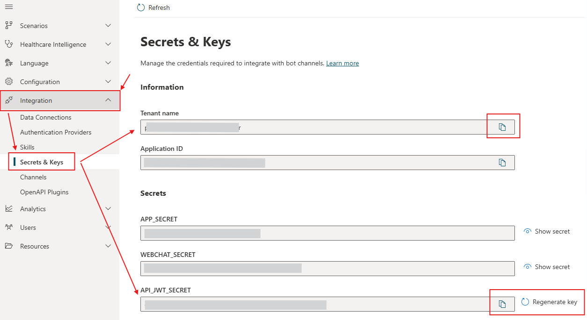

# Azure Healthcare Agent Service

## Introduction

POC to validate healthcare agent service API to manage scenarios.

## Run

Get variables from healthcare agent service panel.



Copy .env.example to .env file and paste variables from healthcare agent service.

> Need to get location from Azure panel to fill "BOT_REGION".

Change file `src/index.js` to run what you want.

Install npm packages and run

```bash
# Install packages
npm install --production
# Run once
npm start
```

## References

- [Healthagent Service - Secrets & Keys][healthagent-service-keys]
- [Management API][healthagent-service-api]
- [Healthbot Code Snippets][healthbot-code-snipets]

<!-- References -->

[healthagent-service-keys]:https://learn.microsoft.com/en-us/azure/health-bot/keys
[healthagent-service-api]: https://learn.microsoft.com/en-us/azure/health-bot/integrations/managementapi
[healthbot-code-snipets]: https://github.com/microsoft/HealthBotCodeSnippets
